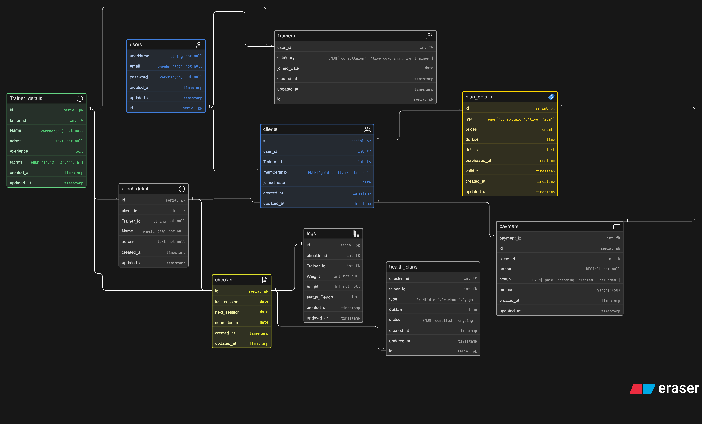

# Fitness Influencer Coaching Platform (DB Design)

## Problem Statement
A fitness influencer has started an online coaching business. Initially, they train a few people through Instagram DMs and video calls. As their brand grows, they need a structured platform to manage clients, coaching plans, consultations, subscriptions, payments, and progress tracking.

This system is designed as an **online coaching ecosystem**, not a gym management system.

---

## Objective
To design an ER diagram that supports:

- Client and trainer management  
- Plan and subscription handling  
- Session and consultation scheduling  
- Progress tracking (weight, reports, check-ins)  
- Payment and transaction records  

---

### ER Diagram:

## Entities (Tables)

### 1. users
Stores all platform users.

- A user can be either a **client or a trainer**
- Common authentication and identity data is stored here

**Fields:**
- id (PK)
- userName
- email
- password
- created_at
- updated_at

---

### 2. clients
Represents users who are enrolled as clients.

- A client is linked to one user
- A client is assigned to a trainer
- A client can subscribe to multiple plans over time

**Fields:**
- id (PK)
- user_id (FK → users.id)
- trainer_id (FK → trainers.id)
- membership (gold / silver / bronze)
- joined_date
- created_at
- updated_at

---

### 3. trainers
Represents coaches/influencers on the platform.

- A trainer can manage multiple clients

**Fields:**
- id (PK)
- user_id (FK → users.id)
- category (consultation / live_coaching / gym_trainer)
- joined_date
- created_at
- updated_at

---

### 4. trainer_details
Stores extended information about trainers.

**Fields:**
- id (PK)
- trainer_id (FK → trainers.id)
- name
- address
- experience
- ratings (1–5)
- created_at
- updated_at

---

### 5. client_detail
Stores additional client profile data.

**Fields:**
- id (PK)
- client_id (FK → clients.id)
- trainer_id
- name
- address
- created_at
- updated_at

---

### 6. checkIn
Represents periodic client check-ins.

- Used for tracking consistency and engagement
- Separate from sessions

**Fields:**
- id (PK)
- last_session
- next_session
- submitted_at
- created_at
- updated_at

---

### 7. logs
Stores progress tracking data.

- Linked to check-ins
- Includes body metrics and reports

**Fields:**
- id (PK)
- checkIn_id (FK → checkIn.id)
- trainer_id (FK → trainers.id)
- weight
- height
- status_report
- created_at
- updated_at

---

### 8. health_plans
Represents workout/diet/yoga plans.

**Fields:**
- id (PK)
- checkIn_id (FK → checkIn.id)
- trainer_id (FK → trainers.id)
- type (diet / workout / yoga)
- duration
- status (completed / ongoing)
- created_at
- updated_at

---

### 9. plan_details
Represents purchasable coaching plans.

- Multiple clients can purchase the same plan

**Fields:**
- id (PK)
- type (consultation / live / gym)
- price
- duration
- details
- purchased_at
- valid_till
- created_at
- updated_at

---

### 10. payment
Stores transaction details.

**Fields:**
- id (PK)
- client_id (FK → clients.id)
- payment_id
- amount
- status (paid / pending / failed / refunded)
- method
- created_at
- updated_at

---

## Relationships & Cardinality

- One **user → one client OR one trainer**
- One **trainer → many clients**
- One **client → many plans (over time)**
- One **plan → many clients**
- One **client → many check-ins**
- One **check-in → many logs**
- One **trainer → many health plans**
- One **client → many payments**
- One **payment → one plan**

---

## Key Design Decisions

- Separation of users, clients, and trainers for flexibility  
- Check-ins separated from logs for structured progress tracking  
- Plans abstracted to support multiple coaching types  
- Payments handled separately for clean financial tracking  
- Health plans linked to check-ins for dynamic updates  

---

## Assumptions

- A user can either be a trainer or a client  
- A client is assigned to one trainer at a time  
- Plans are reusable across multiple clients  
- Progress tracking happens via check-ins  
- Sessions and check-ins are treated differently  

---

## Submission

- ER Diagram exported and uploaded in this repository  
- Diagram includes:
  - Entities with attributes  
  - Primary Keys (PK)  
  - Foreign Keys (FK)  
  - Relationships and cardinality  

---

### Ereaser Link :
